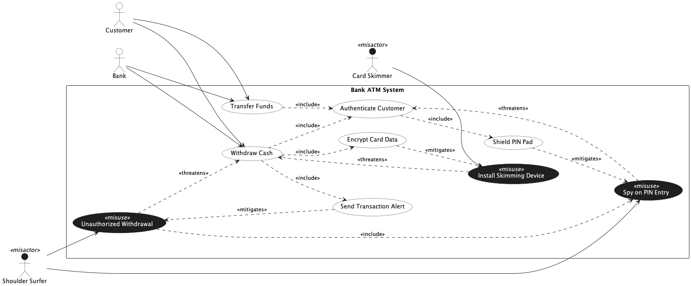

## Trial Run - ATM

LLM used - ChatGPT 5.2 (Default Mode)

### Prompts for intended [model](../atm.png).

[Chat Transcript](https://chatgpt.com/share/699d5365-11ec-8006-95a1-36f8bdf769dd)

1. Generate a misuse case diagram in PlantUML for a Bank ATM System based on the following requirements.
   - Req 1: The system shall allow customers and the bank to transfer funds.
   - Req 2: The system shall allow customers and the bank to withdraw cash.
   - Req 3: As part of transferring funds and withdrawing cash, the system shall always authenticate the customer.
   - Req 4: As part of customer authentication, the system shall always shield the PIN pad.
   - Req 5: As part of withdrawing cash, the system shall always encrypt card data and send a transaction alert.
   - Req 6: A shoulder surfer may spy on a customer's PIN entry, which undermines the customer authentication process.
   - Req 7: A shoulder surfer may perform an unauthorized withdrawal, which includes spying on the PIN entry and undermines the cash withdrawal process.
   - Req 8: A card skimmer may install a skimming device, which undermines the cash withdrawal process.
   - Req 9: Encrypting card data shall serve as a countermeasure against the installation of skimming devices.
   - Req 10: Sending a transaction alert shall serve as a countermeasure against unauthorized withdrawals.
   - Req 11: Shielding the PIN pad shall serve as a countermeasure against spying on PIN entry.

2. Please make the following corrections. First, ensure all include relationships are displayed as dashed arrows rather than solid arrows. Second, ensure all misactor labels are visible by using a dark color so they are readable against the white background.

### Statistics

| Session | Construct Prompts | Visual Prompts | Total Prompts | Result  | Failure reason |
| ------- | ----------------- | -------------- | ------------- | ------- | -------------- |
| 1       | 1                 | 1              | 2             | Success |                |

### Final Output model

