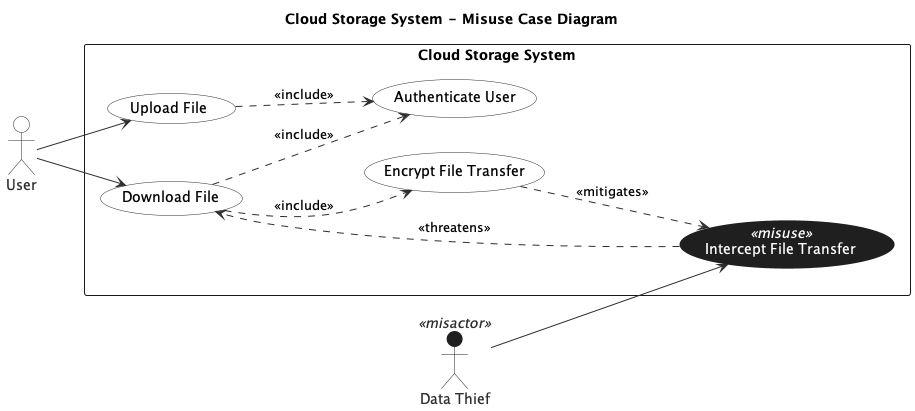

## Trial Run - Cloud storage

LLM used - ChatGPT 5.2 (Default Mode)

### Prompts for intended [model](../cloud_storage.png).

[Chat Transcript](https://chatgpt.com/share/699d4912-d478-8006-a5b1-64dcde7c6094)

1. Generate a misuse case diagram in PlantUML for a Cloud Storage System based on the following requirements.
   - Req 1: The system shall allow users to upload files to the cloud storage platform.
   - Req 2: The system shall allow users to download files from the cloud storage platform.
   - Req 3: As part of uploading or downloading a file, the system shall always authenticate the user.
   - Req 4: As part of downloading a file, the system shall always encrypt the file transfer.
   - Req 5: A data thief may intercept a file transfer to gain unauthorized access to files, which undermines the file download process.
   - Req 6: Encrypting the file transfer shall serve as a countermeasure against file transfer interception.

### Statistics

| Session | Construct Prompts | Visual Prompts | Total Prompts | Result  | Failure reason |
| ------- | ----------------- | -------------- | ------------- | ------- | -------------- |
| 1       | 1                 | 0              | 1             | Success |                |

### Final Output model

