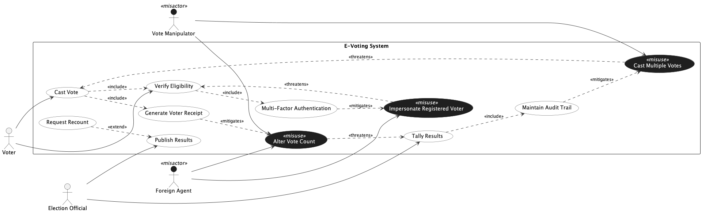

## Trial Run - E-Voting

LLM used - ChatGPT 5.2 (Default Mode)

### Prompts for intended [model](../e-voting.png).

[Chat Transcript](https://chatgpt.com/share/699d562d-532c-8006-962a-508ae333bbc2)

1. Generate a misuse case diagram in PlantUML for an E-Voting System based on the following requirements.
   - Req 1: The system shall allow voters to cast votes.
   - Req 2: The system shall allow voters to verify their eligibility to vote.
   - Req 3: As part of casting a vote, the system shall always verify voter eligibility and generate a voter receipt.
   - Req 4: As part of verifying voter eligibility, the system shall always require multi-factor authentication.
   - Req 5: The system shall allow election officials to tally results and publish results.
   - Req 6: As part of tallying results, the system shall always maintain an audit trail.
   - Req 7: Under certain conditions, a request for a recount may extend the publish results process.
   - Req 8: A vote manipulator may cast multiple votes, which undermines the vote casting process.
   - Req 9: A vote manipulator and a foreign agent may both alter the vote count, which undermines the result tallying process.
   - Req 10: A foreign agent may impersonate a registered voter, which undermines the voter eligibility verification process.
   - Req 11: Generating a voter receipt shall serve as a countermeasure against altering the vote count.
   - Req 12: Requiring multi-factor authentication shall serve as a countermeasure against voter impersonation.
   - Req 13: Maintaining an audit trail shall serve as a countermeasure against casting multiple votes.

2. Please make the following corrections. Ensure all misactor labels are visible by using a dark color so they are readable against the white background. Ensure the stereotype label on all misuse cases is visible by using a contrasting color against the dark background.

3. The stereotype label on all misuse cases is still not visible against the dark background. Please explicitly set the stereotype font color to a light or white color to ensure it is readable.

4. Please use StereotypeFontColor within the misuse case skinparam block to explicitly set the stereotype text color to white, so it is visible against the dark background.

### Statistics

| Session | Construct Prompts | Visual Prompts | Total Prompts | Result  | Failure reason |
| ------- | ----------------- | -------------- | ------------- | ------- | -------------- |
| 1       | 1                 | 3              | 4             | Success |                |

### Final Output model

