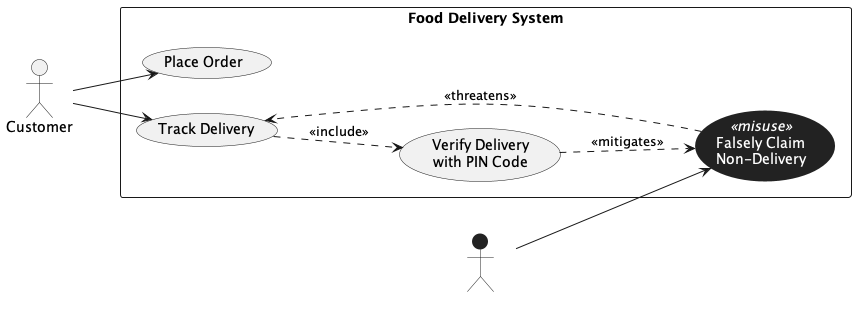

## Trial Run - Food Delivery System

LLM used - ChatGPT 5.2 (Default Mode)

### Prompts for intended [model](../food_delivery.png).

[Chat Transcript](https://chatgpt.com/share/69991456-1518-8006-8872-9c1c092d4f27)

1. Generate a misuse case diagram in PlantUML for a Food Delivery System based on the following requirements.
   - Req 1: The system shall allow customers to place food orders through the platform.
   - Req 2: The system shall allow customers to track the delivery status of their orders in real time.
   - Req 3: As part of tracking a delivery, the system shall always verify the delivery using a PIN code provided to the customer.
   - Req 4: Scammers may falsely claim that a delivery was never received in order to obtain a refund or a replacement order without justification, which undermines the delivery tracking process.
   - Req 5: The PIN code verification mechanism shall serve as a countermeasure against false non-delivery claims.

2. Please make the following corrections. Style all misuse cases with a dark background and white text. Shorten the misuse case name to "Falsely Claim Non-Delivery". Shorten the use case name to "Track Delivery Status".

3. Please ensure the `<<misuse>>` stereotype on all misuse cases is visible by using a contrasting text color against the dark background. Also set the diagram background color to white instead of transparent to avoid the checkerboard pattern.

### Statistics

| Session | Construct Prompts | Visual Prompts | Total Prompts | Result  | Failure reason |
| ------- | ----------------- | -------------- | ------------- | ------- | -------------- |
| 1       | 1                 | 2              | 3             | Success |                |

### Final Output model

