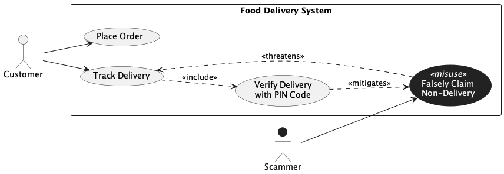

### Prompts for Food Delivery System intended [model](../food_delivery.png).

1. Generate a misuse case diagram adhering to the following specification, and produce the output in PlantUML. The system is a Food Delivery System with one legitimate actor, a Customer, and one misactor, a Scammer. The system contains two regular use cases "Place Order" and "Track Delivery" both initiated by the Customer. There is one security use case "Verify Delivery with PIN Code" which is included by "Track Delivery". There is one misuse case "Falsely Claim Non-Delivery" performed by the Scammer. The misuse case threatens "Track Delivery", and "Verify Delivery with PIN Code" mitigates the misuse case.

2. Please make the following corrections to the diagram. Remove the labels on the associations between the Customer and the legitimate use cases. Also remove the label on the assocation between the Scammer and misuse case. Update the threatens and mitigates labels to be displayed as stereotypes `<<threatens>>` and `<<mitigates>>`. Style the misuse case with a dark background and white text to visually distinguish it as a misuse case. Finally, style the Scammer actor with a dark background to visually distinguish it as a misactor.

3. Please fix the following visibility issues. Ensure the Scammer actor's label is visible by using a contrasting text color. Ensure the `<<misuse>>` stereotype on the misuse case is visible by using a contrasting text color against the dark background.

4. The Scammer actor's label is still not visible because the text color is too light against the white background outside the stickman. Please ensure the actor's label text is displayed in a dark color so it is readable on the white background.

5. Please remove the `<<misactor>>` stereotype from the Scammer actor.

6. Please preserve the case of the misactors' label. The label should be "Scammer" not "scammer"

### Statistics

| Session | Prompts | Result  | Failure reason |
| ------- | ------- | ------- | -------------- |
| 1       | 6       | Success |                |

### Response Summary

- First prompt [output](./output/1.png)
  - Generated model had a "initiates" label on the legitimate use case association. The misuse and misactor association had a "performs" label.
  - The misuse case and misactor did not have a dark background.
  - The threatens and mitigates labels were not displayed as stereotypes.

- Second prompt [output](./output/2.png)
  - The second prompt addressed the mistakes of previous step. But made the misactors' label invisible.
  - The `<<misuse>>` stereotype on the misuse case became invisible now due to the dark background.

- Third prompt [output](./output/3.png)
  - Fixed the visibility issue of the `<<misuse>>` stereotype.
  - But label of misactor is still invisible

- Fourth prompt [output](./output/4.png)
  - Fixed invisibility of misactors' label but added a new non-standard stereotype `<<misactor>>`

- Fifth prompt [output](./output/5.png)
  - Removed the stereotype `<<misactor>>`
  - Broke the case of the misactors' label

- Final prompt [output](./output/6.png)
  - Intended model is generated with minor differences.
  - Without green and red colored associations for mitigates and threatens relationships.
  - With a `<<misuse>>` stereotype.

### Insights

- Biggest concern is that "initiates" and "performs" label were in the first [output](./output/1.png). This shows the LLM is senstive to the prompt, and creates non-standard UML labels. The prompt had "initiated by the Customer", and "performed by the Scammer". Perhaps the prompt should have a structure or a template instead of sentences/paragraph?
- We assume the target LLM knows misuse case notation, or should the prompt be self-contained with enough context to explain it?
- Should we further prompt further the LLM to
  - make sure misactors and misuse cases have a dark/black background?
  - remove stereotypes like `<<misactor>>` and `<<misusecase>>` ?
  - color threatens and mitigates relationship red and green respectively?
- The intented model was almost correct after the second prompt. However, trivial mistakes required 4 more prompts to get the desired output.

### Final Output model

