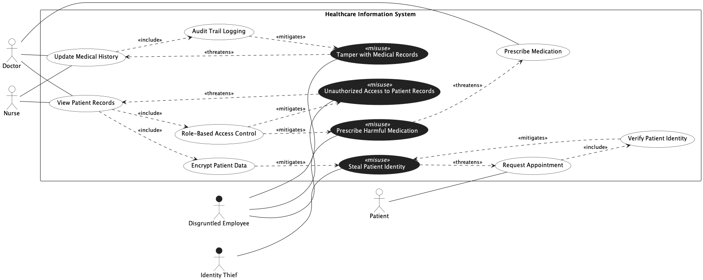

## Trial Run - Healthcare Information System

LLM used - ChatGPT 5.2 (Default Mode)

### Prompts for intended [model](../healthcare.png).

[Chat Transcript](https://chatgpt.com/share/69991909-e0b8-8006-9b9f-33adddb2834b)

1. Generate a misuse case diagram in PlantUML for a Healthcare Information System based on the following requirements.
   - Req 1: The system shall allow doctors and nurses to view patient records.
   - Req 2: The system shall allow doctors and nurses to update medical history.
   - Req 3: The system shall allow doctors to prescribe medication to patients.
   - Req 4: The system shall allow patients to request appointments.
   - Req 5: As part of viewing patient records, the system shall always enforce role-based access control and encrypt patient data.
   - Req 6: As part of updating medical history, the system shall always maintain an audit trail log of all changes.
   - Req 7: As part of requesting an appointment, the system shall always verify the identity of the patient.
   - Req 8: A disgruntled employee may tamper with medical records, which undermines the medical history update process.
   - Req 9: A disgruntled employee may attempt to gain unauthorized access to patient records, which undermines the patient records viewing process.
   - Req 10: A disgruntled employee may prescribe harmful medication to patients, which undermines the medication prescribing process.
   - Req 11: An identity thief may attempt to steal a patient's identity, which undermines the appointment request process.
   - Req 12: Audit trail logging shall serve as a countermeasure against tampering with medical records.
   - Req 13: Role-based access control shall serve as a countermeasure against unauthorized access to patient records and prescribing harmful medication.
   - Req 14: Patient data encryption and patient identity verification shall both serve as countermeasures against patient identity theft.

2. Please make the following corrections. Change all actor to use case associations to directed arrows pointing from the actor to the use case. Style all misuse cases with a dark background and white text, and style all misactors with a dark background and a visible label in a contrasting color.

3. The misactor labels are still not visible. Please ensure all misactor labels are explicitly rendered in a dark color so they are readable against the white background.

### Statistics

| Session | Construct Prompts | Visual Prompts | Total Prompts | Result  | Failure reason |
| ------- | ----------------- | -------------- | ------------- | ------- | -------------- |
| 1       | 1                 | 2              | 3             | Success |                |

### Final Output model

