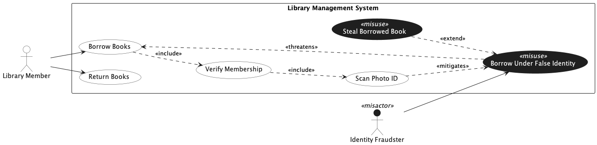

## Trial Run - Library Management System

LLM used - ChatGPT 5.2 (Default Mode)

### Prompts for intended [model](../library.png).

[Chat Transcript](https://chatgpt.com/share/699d4f80-b1d0-8006-b3df-fccc7d3667d3)

1. Generate a misuse case diagram in PlantUML for a Library Management System based on the following requirements.
   - Req 1: The system shall allow library members to borrow books.
   - Req 2: The system shall allow library members to return books.
   - Req 3: As part of borrowing a book, the system shall always verify the membership of the borrower.
   - Req 4: As part of verifying membership, the system shall always scan the member's photo ID.
   - Req 5: An identity fraudster may borrow a book under a false identity, which undermines the book borrowing process.
   - Req 6: After borrowing a book under a false identity, the fraudster may additionally steal the borrowed book by never returning it.
   - Req 7: Scanning the member's photo ID shall serve as a countermeasure against borrowing under a false identity.

2. Please make the following corrections. First, enclose all use cases within a system boundary rectangle labeled "Library Management System". Second, remove the `<<threatens>>` relationship between "Borrow Under False Identity" and "Verify Membership", as the misuse case only threatens "Borrow Book". Third, remove the association between the Identity Fraudster and "Steal Borrowed Book", as the fraudster should only be directly associated with "Borrow Under False Identity".

3. The Library Member actor has been incorrectly styled with a dark background. Please ensure only misactors have a dark background, and restore the Library Member actor to the default styling with a white background and dark label.

4. Please shorten the misuse case name to "Steal Borrowed Book" by removing the "(Never Return)" part.

### Statistics

| Session | Construct Prompts | Visual Prompts | Total Prompts | Result  | Failure reason |
| ------- | ----------------- | -------------- | ------------- | ------- | -------------- |
| 1       | 2                 | 2              | 4             | Success |                |

### Final Output model

