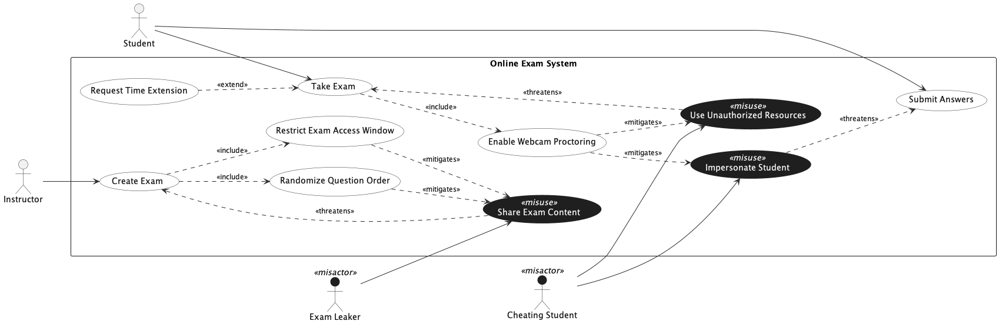

## Trial Run - Online Exam

LLM used - ChatGPT 5.2 (Default Mode)

### Prompts for intended [model](../online_exam.png).

[Chat Transcript](https://chatgpt.com/share/699d5ef9-ddac-8006-88fd-e2e59982cee7)

1. Generate a misuse case diagram in PlantUML for an Online Exam System based on the following requirements.
   - Req 1: The system shall allow students to take exams.
   - Req 2: The system shall allow students to submit answers.
   - Req 3: The system shall allow instructors to create exams.
   - Req 4: Under certain conditions, a student may request a time extension, which extends the exam taking process.
   - Req 5: As part of taking an exam, the system shall always enable webcam proctoring.
   - Req 6: As part of creating an exam, the system shall always randomize the question order and restrict the exam access window.
   - Req 7: A cheating student may use unauthorized resources during an exam, which undermines the exam taking process.
   - Req 8: A cheating student may impersonate another student, which undermines the answer submission process.
   - Req 9: An exam leaker may share exam content, which undermines the exam creation process.
   - Req 10: Webcam proctoring shall serve as a countermeasure against the use of unauthorized resources and student impersonation.
   - Req 11: Randomizing the question order and restricting the exam access window shall both serve as countermeasures against sharing exam content.

2. Please move all actors and misactors outside the system boundary rectangle, as actors should not be enclosed within the system context boundary in use case diagrams.

### Statistics

| Session | Construct Prompts | Visual Prompts | Total Prompts | Result  | Failure reason |
| ------- | ----------------- | -------------- | ------------- | ------- | -------------- |
| 1       | 1                 | 1              | 2             | Success |                |

### Final Output model

