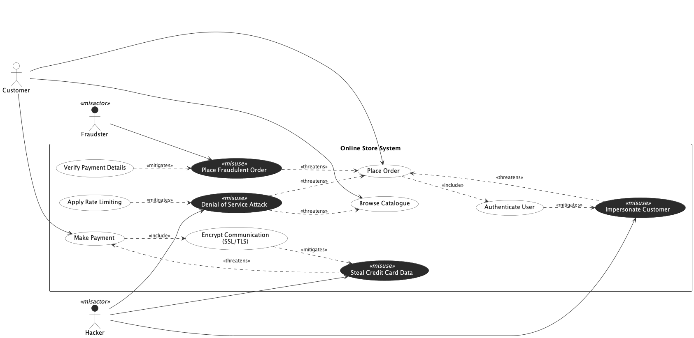

## Trial Run - Online Store

LLM used - ChatGPT 5.2 (Default Mode)

### Prompts for intended [model](../online_store.png).

[Chat Transcript](https://chatgpt.com/share/699d60e1-8a74-8006-888c-43eeef5ce2b0)

1. Generate a misuse case diagram in PlantUML for an Online Store System based on the following requirements.
   - Req 1: The system shall allow customers to browse the product catalogue.
   - Req 2: The system shall allow customers to place orders.
   - Req 3: The system shall allow customers to make payments.
   - Req 4: As part of making a payment, the system shall always encrypt communication using SSL/TLS.
   - Req 5: As part of placing an order, the system shall always authenticate the user.
   - Req 6: A fraudster may place a fraudulent order, which undermines the order placement process.
   - Req 7: A hacker may steal credit card data, which undermines the payment process.
   - Req 8: A hacker may launch a denial of service attack, which undermines both the order placement process and the catalogue browsing process.
   - Req 9: A hacker may impersonate a customer, which undermines the order placement process.
   - Req 10: Verifying payment details shall serve as a countermeasure against fraudulent orders.
   - Req 11: Encrypting communication shall serve as a countermeasure against credit card data theft.
   - Req 12: Applying rate limiting shall serve as a countermeasure against denial of service attacks.
   - Req 13: Authenticating the user shall serve as a countermeasure against customer impersonation.

2. Please move all actors and misactors outside the system boundary rectangle, as actors should not be enclosed within the system context boundary in use case diagrams.

### Statistics

| Session | Construct Prompts | Visual Prompts | Total Prompts | Result  | Failure reason |
| ------- | ----------------- | -------------- | ------------- | ------- | -------------- |
| 1       | 1                 | 1              | 2             | Success |                |

### Final Output model

