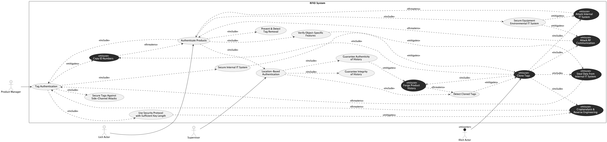

## Trial Run - RFID

LLM used - ChatGPT 5.2 (Default Mode)

### Prompts for intended [model](../rfid.png).

[Chat Transcript](https://chatgpt.com/share/699d459b-3f00-8006-8d81-cbace7fca83d)

1. Generate a misuse case diagram in PlantUML for an RFID system based on the following requirements.
   - Req 1: The system shall allow the Product Manager to perform tag authentication.

   - Req 2: As part of tag authentication, the system shall always use a security protocol with sufficient key length, secure the internal IT system, and secure tags against side channel attacks.

   - Req 3: The system shall allow the Licit Actor to authenticate products.

   - Req 4: As part of authenticating a product, the system shall always perform tag authentication, verify object specific features, prevent and detect tag removal, secure the equipment environmental IT system, and perform location based authentication.

   - Req 5: The system shall allow the Supervisor to perform location based authentication.

   - Req 6: As part of location based authentication, the system shall always guarantee the integrity of history, guarantee the authenticity of history, and detect cloned tags.

   - Req 7: An illicit actor may clone tags, which includes performing cryptanalysis and reverse engineering, stealing data from the internal IT system, copying ID numbers, attacking the internal IT system, attacking RF communication, and forging product history.

   - Req 8: Cryptanalysis and reverse engineering threatens the tag authentication process.

   - Req 9: Data theft from the internal IT system threatens the tag authentication process.

   - Req 10: ID number copying threatens the product authentication process.

   - Req 11: An attack against the internal IT system threatens the product authentication process.

   - Req 12: An attack against RF communication threatens the product authentication process.

   - Req 13: Forgery of product history threatens the ability to detect cloned tags.

   - Req 14: Using a security protocol with sufficient key length shall serve as a countermeasure against cryptanalysis and reverse engineering.

   - Req 15: Securing the internal IT system shall serve as a countermeasure against data theft from the internal IT system.

   - Req 16: Tag authentication shall serve as a countermeasure against ID number copying.

   - Req 17: Verifying object specific features and detecting cloned tags shall both serve as countermeasures against tag cloning.

   - Req 18: Securing the equipment environmental IT system shall serve as a countermeasure against attacks against the internal IT system and attacks against RF communication.

   - Req 19: Guaranteeing the authenticity of history shall serve as a countermeasure against forgery of product history.

2. The `<<include>>` stereotype label on the link between "Tag Authentication" and "Use Security Protocol with Sufficient Key Length" is not visible. Please ensure all `<<include>>` stereotype labels on links are clearly visible.

### Statistics

| Session | Construct Prompts | Visual Prompts | Total Prompts | Result  | Failure reason |
| ------- | ----------------- | -------------- | ------------- | ------- | -------------- |
| 1       | 1                 | 1              | 2             | Success |                |

### Final Output model

