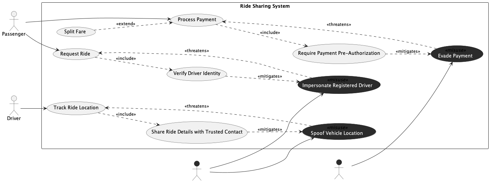

## Trial Run - Ride Sharing System

LLM used - ChatGPT 5.2 (Default Mode)

### Prompts for intended [model](../rideshare.png).

[Chat Transcript](https://chatgpt.com/share/69991631-2528-8006-88d9-1ef203c168c5)

1. Generate a misuse case diagram in PlantUML for a Ride Sharing System based on the following requirements.
   - Req 1: The system shall allow passengers to request a ride through the platform.
   - Req 2: The system shall allow passengers to process payment for their ride.
   - Req 3: When processing a payment, passengers may optionally split the fare with others.
   - Req 4: The system shall allow drivers to track the ride location during an active trip.
   - Req 5: As part of requesting a ride, the system shall always verify the identity of the assigned driver.
   - Req 6: As part of tracking the ride location, the system shall always share ride details with a trusted contact of the passenger.
   - Req 7: As part of processing a payment, the system shall always require payment pre-authorization.
   - Req 8: A fake driver may impersonate a registered driver to fraudulently accept rides, which undermines the ride request process.
   - Req 9: A fake driver may spoof the vehicle location to deceive passengers, which undermines the ride location tracking process.
   - Req 10: A fare cheat may attempt to evade payment after completing a ride, which undermines the payment process.
   - Req 11: Driver identity verification shall serve as a countermeasure against driver impersonation.
   - Req 12: Sharing ride details with a trusted contact shall serve as a countermeasure against vehicle location spoofing.
   - Req 13: Payment pre-authorization shall serve as a countermeasure against fare evasion.

2. The associations between actors and use cases are using plain lines instead of directed arrows. Please change all actor to use case associations to directed arrows pointing from the actor to the use case.

### Statistics

| Session | Construct Prompts | Visual Prompts | Total Prompts | Result  | Failure reason |
| ------- | ----------------- | -------------- | ------------- | ------- | -------------- |
| 1       | 1                 | 1              | 2             | Success |                |

### Final Output model

