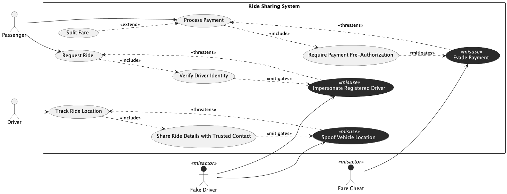

## Trial Run - Ride Sharing System

LLM used - ChatGPT 5.2 (Default Mode)

### Prompts for intended [model](../rideshare.png).

1. Generate a misuse case diagram adhering to the following specification, and produce the output in PlantUML. The system is a Ride Sharing System with two legitimate actors, a Passenger and a Driver, and two misactors, a Fake Driver and a Fare Cheat. The system contains three regular use cases "Request Ride" and "Process Payment" both initiated by the Passenger, and "Track Ride Location" initiated by the Driver. There is one extending use case "Split Fare" which extends "Process Payment". There are three security use cases "Verify Driver Identity" included by "Request Ride"; "Share Ride Details with Trusted Contact" included by "Track Ride Location"; and "Require Payment Pre-Authorization" included by "Process Payment". There are three misuse cases "Impersonate Registered Driver" and "Spoof Vehicle Location" both performed by the Fake Driver; and "Evade Payment" performed by the Fare Cheat. "Impersonate Registered Driver" threatens "Request Ride"; "Spoof Vehicle Location" threatens "Track Ride Location"; and "Evade Payment" threatens "Process Payment". "Verify Driver Identity" mitigates "Impersonate Registered Driver"; "Share Ride Details with Trusted Contact" mitigates "Spoof Vehicle Location"; and "Require Payment Pre-Authorization" mitigates "Evade Payment".

2. Please style all misuse cases with a dark background and white text, and all misactors with a dark background.

3. Please fix the following two visibility issues. First, ensure the `<<misuse>>` stereotype on all misuse cases is visible by using a contrasting text color against the dark background. Second, ensure all misactor labels are visible by using a contrasting text color against the dark background.

4. The misactor labels are still not visible against the dark background. Please ensure all misactor labels are displayed in a contrasting color so they are readable.

### Responses

1. All constructs are generated correctly in [output 1](./output/1.png). Visual issues observed
   - Misuse case and misactor doesn't have a dark/black background

2. Visual issues observed in [output 2](./output/2.png)
   - Stereotype of misusecases invisible
   - Label of misactor invisible

3. Visual issues observed in [output 3](./output/3.png)
   - Label of misactor invisible

### Statistics

| Session | Construct Prompts | Visual Prompts | Total Prompts | Result  | Failure reason |
| ------- | ----------------- | -------------- | ------------- | ------- | -------------- |
| 1       | 1                 | 3              | 4             | Success |                |

### Final Output model

