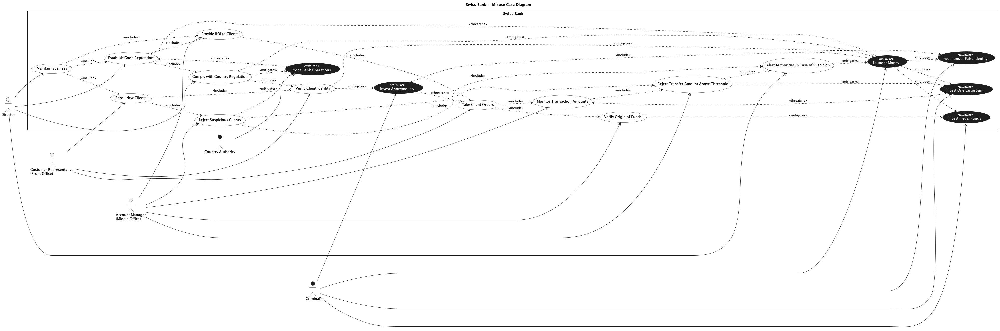

## Trial Run - Swiss Bank

LLM used - ChatGPT 5.2 (Default Mode)

### Prompts for intended [model](../swissbank.png).

[Chat Transcript](https://chatgpt.com/share/69967d12-f774-8006-8468-7cf397f8977b)

1. Generate a misuse case diagram adhering to the following specification, and produce the output in PlantUML. The system is a Swiss Bank with three legitimate actors a Director, a Customer Representative (Front Office), and an Account Manager (Middle Office); and two misactors a Criminal and a Country Authority.

   The system contains the following regular use cases. The Director initiates "Maintain Business", "Establish Good Reputation", "Comply with Country Regulation", and "Alert Authorities in Case of Suspicion". The Customer Representative initiates "Enroll New Clients", "Verify Client Identity", and "Take Client Orders". The Account Manager initiates "Provide ROI to Clients", "Verify Origin of Funds", "Monitor Transaction Amounts", "Reject Transfer Amount Above Threshold", and "Reject Suspicious Clients".

   The include relationships among regular use cases are as follows "Maintain Business" includes "Establish Good Reputation", "Enroll New Clients", and "Provide ROI to Clients". "Establish Good Reputation" includes "Comply with Country Regulation" and "Provide ROI to Clients". "Comply with Country Regulation" includes "Verify Client Identity". "Enroll New Clients" includes "Verify Client Identity" and "Reject Suspicious Clients". "Provide ROI to Clients" includes "Take Client Orders". "Take Client Orders" includes "Verify Origin of Funds" and "Monitor Transaction Amounts". "Monitor Transaction Amounts" includes "Reject Transfer Amount Above Threshold". "Reject Suspicious Clients" includes "Reject Transfer Amount Above Threshold" and "Alert Authorities in Case of Suspicion". "Reject Transfer Amount Above Threshold" includes "Alert Authorities in Case of Suspicion".

   There are six misuse cases "Launder Money", "Invest Anonymously", "Invest under False Identity", "Invest Illegal Funds", "Invest One Large Sum", and "Probe Bank Operations". The Criminal performs all misuse cases except "Probe Bank Operations", which is performed by the Country Authority. Additionally, "Launder Money" includes "Invest Anonymously", "Invest under False Identity", "Invest Illegal Funds", and "Invest One Large Sum".

   The threatens relationships are as follows "Probe Bank Operations" and "Launder Money" both threaten "Establish Good Reputation". "Invest Anonymously" threatens "Take Client Orders". "Invest One Large Sum" threatens "Monitor Transaction Amounts".

   The mitigates relationships are as follows "Comply with Country Regulation" mitigates "Probe Bank Operations" and "Launder Money". "Verify Client Identity" mitigates "Invest Anonymously" and "Invest under False Identity". "Verify Origin of Funds" mitigates "Invest Illegal Funds". "Reject Transfer Amount Above Threshold" mitigates "Invest One Large Sum". "Alert Authorities in Case of Suspicion" mitigates "Launder Money". "Reject Suspicious Clients" mitigates "Probe Bank Operations".

2. Please ensure the stereotype text on all misuse cases is displayed in a contrasting color so it is visible against the dark background.

### Responses

1. All expected constructs are generated correctly in [Output 1](./output/1.png). Visual issues observed
   - stereotype `<<misuse>>` is not visible

### Statistics

| Session | Construct Prompts | Visual Prompts | Total Prompts | Result  | Failure reason |
| ------- | ----------------- | -------------- | ------------- | ------- | -------------- |
| 1       | 1                 | 1              | 2             | Success |                |

### Final Output model

