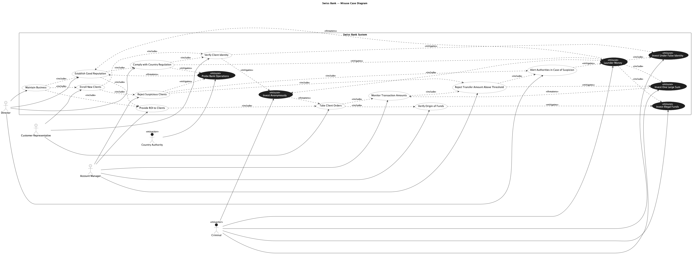

## Trial Run - Swiss Bank

LLM used - ChatGPT 5.2 (Default Mode)

### Prompts for intended [model](../swissbank.png).

[Chat Transcript](https://chatgpt.com/share/699ac0dd-f6d8-8006-b0de-c1ac89778a8c)

1. Generate a misuse case diagram in PlantUML for a Swiss Bank based on the following requirements.
   - Req 1: The system shall allow the Director to maintain the bank's business operations, which includes establishing a good reputation, enrolling new clients, and providing return on investment to clients.
   - Req 2: Establishing a good reputation requires the bank to comply with country regulations and provide return on investment to clients.
   - Req 3: Complying with country regulations requires verifying the identity of all clients.
   - Req 4: The system shall allow the Customer Representative to enroll new clients, which always includes verifying client identity and rejecting suspicious clients.
   - Req 5: The system shall allow the Customer Representative to verify client identity and take client orders.
   - Req 6: Providing return on investment to clients always includes taking client orders.
   - Req 7: Taking client orders always includes verifying the origin of funds and monitoring transaction amounts.
   - Req 8: Monitoring transaction amounts always includes rejecting any transfer amount above a defined threshold.
   - Req 9: Rejecting suspicious clients always includes rejecting transfers above the threshold and alerting authorities in case of suspicion.
   - Req 10: Rejecting a transfer above the threshold always triggers alerting the authorities.
   - Req 11: The system shall allow the Account Manager to provide return on investment to clients, verify the origin of funds, monitor transaction amounts, reject transfers above a threshold, and reject suspicious clients.
   - Req 12: The Director shall have the ability to alert authorities in case of suspicion.
   - Req 13: A criminal may attempt to launder money, which includes investing anonymously, investing under a false identity, investing illegal funds, and investing one large sum. Money laundering threatens the bank's ability to establish a good reputation.
   - Req 14: A criminal may invest anonymously, which threatens the client order taking process.
   - Req 15: A criminal may invest under a false identity directly.
   - Req 16: A criminal may invest illegal funds directly.
   - Req 17: A criminal may invest one large sum, which threatens the transaction monitoring process.
   - Req 18: A country authority may probe bank operations, which threatens the bank's ability to establish a good reputation.
   - Req 19: Complying with country regulations shall serve as a countermeasure against money laundering and probing of bank operations.
   - Req 20: Verifying client identity shall serve as a countermeasure against anonymous investment and investment under a false identity.
   - Req 21: Verifying the origin of funds shall serve as a countermeasure against investment of illegal funds.
   - Req 22: Rejecting transfers above the threshold shall serve as a countermeasure against investing one large sum.
   - Req 23: Alerting authorities shall serve as a countermeasure against money laundering.
   - Req 24: Rejecting suspicious clients shall serve as a countermeasure against probing of bank operations.

### Statistics

| Session | Construct Prompts | Visual Prompts | Total Prompts | Result  | Failure reason |
| ------- | ----------------- | -------------- | ------------- | ------- | -------------- |
| 1       | 1                 | 0              | 1             | Success |                |

### Final Output model

