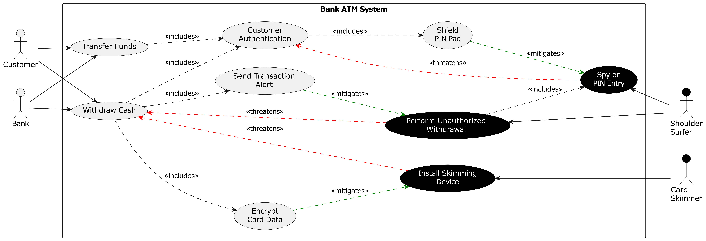
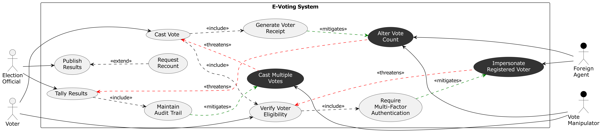

# LLM-Based Misuse Case Diagram Generation

[](https://www.scitepress.org/publishedPapers/2026/150140/pdf/)
[](https://openai.com/)
[](https://plantuml.com/)
[]()
[]()

Supplementary material for the paper published at [**ENASE 2026**](https://www.scitepress.org/publishedPapers/2026/150140/pdf/) — the 21st International Conference on Evaluation of Novel Approaches to Software Engineering.

This repository contains the **intended misuse case diagrams** and **trial session records** for 12 software systems of varying complexity. It evaluates the capability of a large language model (LLM) to generate [misuse case](https://en.wikipedia.org/wiki/Misuse_case) diagrams in [PlantUML](https://plantuml.com/) from structured natural-language security requirements. No diagram syntax is provided by the user.

All 12 case studies were completed in a **single conversation session** using **ChatGPT 5.2 (Default Mode)**, requiring between **1 and 4 prompts** to reach the intended model.

---

## Background

Misuse case diagrams extend UML use case diagrams with adversarial actors (*misactors*) and adversarial behaviours (*misuse cases*), connected to regular use cases via `<<threatens>>` and `<<mitigates>>` relationships. They are a practical technique for eliciting and communicating security requirements during early-stage software design.

### Prompt categories

Each trial distinguishes two types of follow-up prompts needed after the initial generation request:

| Category | Description |
|---|---|
| **Construct prompts** | Correct structural errors — missing relationships, wrong stereotypes, incorrect includes |
| **Visual prompts** | Correct rendering issues — invisible labels, wrong colors, illegible stereotype text |

---

## Case Studies

12 systems were selected across three complexity tiers defined by the number of UML constructs in the intended model.

| System | Size | Constructs | Construct Prompts | Visual Prompts | Total Prompts | Intended Model | Trial |
|---|---|:---:|:---:|:---:|:---:|:---:|:---:|
| Food Delivery | Small | 9 | 1 | 2 | 3 | [model](misusecases/food_delivery/food_delivery.png) | [trial](misusecases/food_delivery/trial/trial.md) |
| Cloud Storage | Small | 12 | 1 | 0 | **1** | [model](misusecases/cloud_storage/cloud_storage.png) | [trial](misusecases/cloud_storage/trial/trial.md) |
| Library | Small | 13 | 2 | 2 | **4** | [model](misusecases/library/library.png) | [trial](misusecases/library/trial/trial.md) |
| Rideshare | Medium | 24 | 1 | 1 | 2 | [model](misusecases/rideshare/rideshare.png) | [trial](misusecases/rideshare/trial/trial.md) |
| Smart Home | Medium | 24 | 1 | 1 | 2 | [model](misusecases/smart_home/smart_home.png) | [trial](misusecases/smart_home/trial/trial.md) |
| ATM | Medium | 25 | 1 | 1 | 2 | [model](misusecases/atm/atm.png) | [trial](misusecases/atm/trial/trial.md) |
| Online Exam | Medium | 25 | 1 | 1 | 2 | [model](misusecases/online_exam/online_exam.png) | [trial](misusecases/online_exam/trial/trial.md) |
| Online Store | Medium | 25 | 1 | 1 | 2 | [model](misusecases/online_store/online_store.png) | [trial](misusecases/online_store/trial/trial.md) |
| E-Voting | Medium | 26 | 1 | 3 | **4** | [model](misusecases/e-voting/e-voting.png) | [trial](misusecases/e-voting/trial/trial.md) |
| Healthcare | Medium | 30 | 1 | 2 | 3 | [model](misusecases/healthcare/healthcare.png) | [trial](misusecases/healthcare/trial/trial.md) |
| RFID | Large | 54 | 1 | 1 | 2 | [model](misusecases/rfid/rfid.png) | [trial](misusecases/rfid/trial/trial.md) |
| Swiss Bank | Large | 54 | 1 | 0 | **1** | [model](misusecases/swissbank/swissbank.png) | [trial](misusecases/swissbank/trial_2/trial.md) |

**All 12 trials succeeded in a single session.**

---

## Sample Diagrams

**ATM System** (Medium — 25 constructs)



**E-Voting System** (Medium — 26 constructs)



**RFID System** (Large — 54 constructs)


**Swiss Bank** (Large — 54 constructs)


---

## Repository Structure

```
misusecases/
├── <system>/
│   ├── <system>.puml          # Intended (reference) PlantUML source
│   ├── <system>.svg           # Intended diagram (SVG)
│   ├── <system>.png           # Intended diagram (PNG, 600 DPI)
│   └── trial/                 # trial_2/ for Swiss Bank (first trial was exploratory)
│       ├── trial.md           # Full prompt sequence, ChatGPT transcript link, and statistics
│       └── output/            # Rendered PNG for each prompt iteration
│           ├── 1.puml
│           ├── 1.png
│           └── ...
├── trial_results.csv          # Prompt counts per system
└── Descriptive_statistics.csv # UML construct counts per intended model
```

Each `trial.md` contains:
- The complete prompt sequence given to ChatGPT
- A link to the full ChatGPT conversation transcript
- A statistics table recording prompt counts and outcome

---

## Citation

If you use this material in your work, please cite the associated paper:

```bibtex
@inproceedings{khan2026evaluating,
  title     = {Evaluating {ChatGPT-5} for Misuse Case Diagram Generation:
               An Empirical Evaluation},
  author    = {Alzarooni, Alia and Khan, Yasser and Alsayegh, Hassan and
               El-Attar, Mohamed and Grati, Rima},
  booktitle = {Proceedings of the 21st International Conference on Evaluation
               of Novel Approaches to Software Engineering (ENASE 2026)},
  pages     = {599--610},
  year      = {2026},
  publisher = {SciTePress},
  doi       = {10.5220/0015014000004999},
  url       = {https://www.scitepress.org/publishedPapers/2026/150140/pdf/}
}
```
